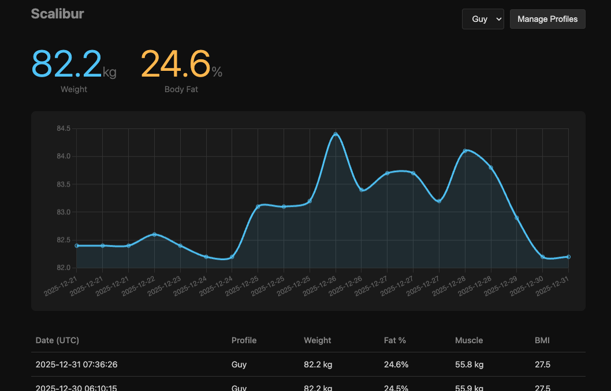

I step on a bathroom scale and my body fat percentage gets beamed to a server in Shenzhen. This is the arrangement. In exchange for this intimacy, the app suggests I upgrade to premium, which I find touching in a way the developers probably didn't intend.

I don't have a problem with companies making money — I have a problem with the default. The default is: your body's measurements belong to someone else's database, and you're welcome to look at them through their app, on their terms, until they pivot to a different business model or get acqui-hired and shut down the API. The data isn't especially sensitive on its own. Nobody is going to blackmail me with my impedance readings. But if I can't own the numbers that describe my own physical form, what exactly can I own? It's a question worth asking, even if the answer turns out to be "not much, but you should try anyway."

So I bought a cheap Bluetooth scale for £20 and wondered whether I might intercept the data before it left the building.

It turned out that the scale, in its eagerness to communicate, simply shouts its measurements into the air as Bluetooth Low Energy advertisements. No pairing required, no handshake, no authentication whatsoever. Anyone with a Raspberry Pi and some patience can listen in. The scale has the operational security of a man on a megaphone.

The patience part proved non-trivial. My git history contains two consecutive commits with directly contradictory theories about where in the data packet the weight was encoded. Both were wrong, though in interestingly different ways — I was consistently off by exactly one byte, which is the kind of systematic error that makes you feel like you're nearly right when you're actually just consistently wrong. Eventually I worked out the structure: weight in the first two bytes, impedance in the next two, and a small flag that tells you whether the measurement is complete or if the scale is still thinking it over.

The harder problem came later. My household has several people who use the scale, and distinguishing between them required some form of identification. The scale does include a user ID field, presumably for this purpose, but it proved unreliable in ways I never fully diagnosed and eventually stopped trying to. The solution was almost disappointingly simple: identify people by their weight. Household members, it turns out, have weight ranges that rarely overlap. A reading of 75kg belongs to one person; 55kg to another. Nearest-neighbour classification in one dimension. No elaborate biometric scheme required.

The whole thing now runs on a Raspberry Pi in a cupboard, quietly recording measurements and displaying them on a small dashboard. It's not sophisticated — a few Python scripts, a SQLite database, a web page that would not trouble any design awards. But there is a specific satisfaction in knowing exactly where your data lives. It lives in a cupboard, next to the router, on hardware I own, running code I wrote, storing numbers in a format I chose. The entire pipeline from bare feet to bar chart is under my roof.

This isn't a manifesto. I use plenty of cloud services and don't lose sleep over them. But some data feels more personal than other data, and the default arrangement — your information, their servers, their terms, their timeline — is not the only option available. Occasionally it's worth checking.

In this case, a £20 scale and a spare afternoon was all it took to tip the balance back. Literally.

---

*For the technical details — BLE packet structures, Python code, deployment scripts — see [the full write-up](/posts/scalibur/). The code is on [GitHub](https://github.com/gfrmin/scalibur).*
