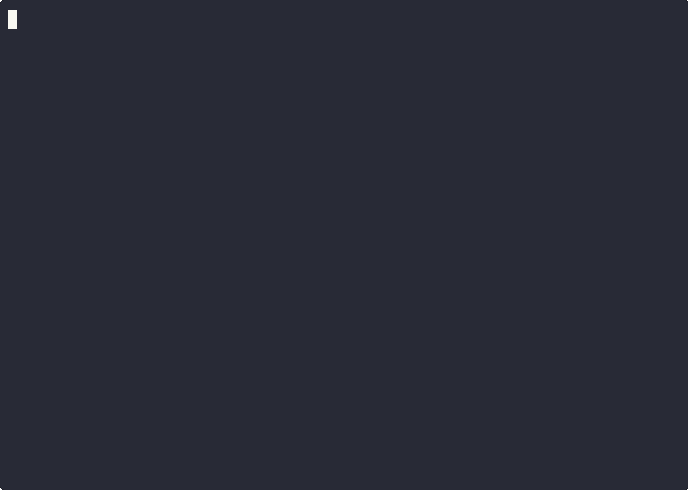

You're stranded somewhere unfamiliar with twelve types of food scattered around. Some provide energy. Others are toxic. You don't know which is which, you're losing energy with every step, and nobody left a manual. The question is whether you can learn fast enough to survive.

This is the exploration-exploitation tradeoff, and it's one of those problems that sounds like a thought experiment until you actually have to solve it. Pure exploration --- trying everything at random --- kills you. Pure exploitation --- eating only what you currently believe is best --- starves you when better options exist two metres away. You need something that balances both, and ideally something with a mathematical proof attached.

Bayesian inference, as it happens, provides exactly this. I built a simulation to watch the learning process unfold: an agent navigating a grid world, updating its beliefs about food types using exact conjugate priors, and making decisions through Thompson Sampling. No neural networks. No reinforcement learning frameworks. Just probability theory and about 200 lines of Python. As someone who spent several years of his life inside a statistics department, I find this deeply pleasing, in the way that a well-set prior is pleasing --- quietly correct before any data arrives.

## The Demo

The simulation runs in your terminal using curses. The agent (@) navigates a 30x15 grid populated with foods represented by shapes (●, ■, ▲) in various colours. A live belief table shows what the agent has learned about each food type --- higher numbers mean more energy, negative numbers mean toxic.



As the agent explores, you can watch uncertainty collapse. Belief bars narrow. Means migrate toward true values. Behaviour evolves from random wandering to purposeful pursuit of the good stuff. It is, if you'll permit the enthusiasm, Bayesian inference made visible. I have watched it more times than is professionally advisable.

## The Problem: Exploration vs. Exploitation

The agent starts with 10 energy units and loses 0.1 per step. It can see nearby food and must decide what to pursue. There are 12 food types: 3 shapes (circle, square, triangle) x 4 colours (red, green, blue, yellow). Each type has an unknown true energy distribution --- some are consistently nourishing (circles), some reliably toxic (triangles), and some are gambles of the sort your supervisor would call "high variance" (squares).

How do you decide what to eat when you don't know what's safe? This question has a long and distinguished history in statistics, and the answer I chose is Thompson Sampling. Instead of fixed exploration rates or elaborate formulae, it uses an idea of such elegant simplicity that I suspect it annoys people who prefer their solutions complicated: sample from your posterior belief about each food type, then pick the one with the highest sampled value.

```{python}
def select_target_food(self, available_foods):
    """Select food using Thompson Sampling."""
    best_value = -float('inf')
    best_position = None

    for position, shape, color in available_foods:
        # Sample energy from our belief distribution
        belief = self.beliefs[(shape, color)]
        sampled_energy = np.random.normal(belief["mean"],
                                         np.sqrt(belief["variance"]))

        # Account for distance cost
        distance = abs(position[0] - self.position[0]) + \
                  abs(position[1] - self.position[1])
        value = sampled_energy - distance * MOVEMENT_COST

        if value > best_value:
            best_value = value
            best_position = position

    return best_position
```

The elegance lies in what this achieves without trying:

- **High uncertainty = wide distribution = exploration**: When you haven't tried a food much, its belief distribution is broad. Occasionally you'll sample an extreme value, which sends you off to investigate. This is exploration arising from honest uncertainty rather than a coin flip.
- **Low uncertainty = narrow distribution = exploitation**: Once you've eaten something ten times, the distribution narrows. Samples consistently reflect the true mean, and the agent stops wasting energy on known quantities.
- **No hyperparameters**: The uncertainty itself governs the exploration rate. It adapts automatically. Nobody needs to choose an epsilon. Nobody needs to tune a constant. The mathematics handles it.

## The Math: Conjugate Priors Made Simple

Each food type has an unknown true energy value. The agent maintains a belief distribution over what that value might be, represented as a Normal distribution with mean mu (expected energy), variance sigma-squared (uncertainty), and pseudo-observation count n (effective sample size).

Initially, the agent knows nothing, which we encode with the dignified formalism of complete ignorance:

```python
# Prior belief for each food type
μ₀ = 0.0      # Neutral expectation
σ₀² = 10.0    # High uncertainty
n₀ = 0.1      # Weak prior (easily overridden)
```

A prior mean of zero says "I have no opinion." A variance of 10 says "I really mean it." A pseudo-count of 0.1 says "I will change my mind at the slightest provocation." This is the Bayesian equivalent of showing up to a wine tasting having never had wine.

When the agent eats a food and observes its energy, it updates using **conjugate Bayesian inference**. This is exact mathematics, not an approximation --- the Normal-Normal conjugate pair gives you the true posterior in closed form:

```{python}
def update_belief(self, shape, color, observed_energy):
    """
    Update belief using exact Bayesian inference (Normal-Normal conjugate).

    Prior: μ ~ N(μ₀, σ₀²)
    Likelihood: x ~ N(μ, σ²)
    Posterior: μ ~ N(μ₁, σ₁²)
    """
    belief = self.beliefs[(shape, color)]

    # Prior parameters
    prior_mean = belief["mean"]
    prior_variance = belief["variance"]
    n = belief["n"]

    # Weights for combining prior and observation
    observation_weight = 1.0
    total_weight = n + observation_weight

    # Posterior mean: weighted average of prior and observation
    new_mean = (n * prior_mean + observation_weight * observed_energy) / \
               total_weight

    # Posterior variance: always decreases with more data
    new_variance = prior_variance / (1 + observation_weight / n)

    # Update belief
    belief["mean"] = new_mean
    belief["variance"] = new_variance
    belief["n"] = n + observation_weight
```

This is the mathematical heart of the system, and if you've spent time with Bayesian statistics you'll recognise it immediately. Two properties make it beautiful:

1. **The posterior mean is a weighted average** of the prior and the observation. Early data has enormous influence; later observations refine. The first time the agent eats a red circle and gets +3 energy, its belief shifts dramatically. The hundredth time, barely a nudge. This is how learning should work, and here it falls out of the algebra for free.

2. **Uncertainty always decreases** with observation. After one data point, variance drops from 10.0 to about 9.1. After ten, it's down to 0.9. The agent becomes progressively more confident, which is to say progressively less interesting at dinner parties.

No MCMC sampling. No variational inference. No neural network approximations. The Normal-Normal conjugate pair gives you the exact posterior. The math just works. I realise this sounds like the sort of thing a Bayesian would say about everything, and I want to be clear: in this case it's literally true.

## Thompson Sampling: The Exploration Strategy

Why Thompson Sampling over the alternatives?

**Epsilon-greedy** uses a fixed exploration rate: with probability epsilon, pick something at random; otherwise exploit. The difficulty is that epsilon is arbitrary. Too high and you waste energy on foods you already know are terrible. Too low and you never discover that blue squares are actually quite good. And the rate never adapts --- you explore exactly as much on step 1,000 as on step 1, which is rather like continuing to check whether gravity works.

**Upper Confidence Bound (UCB)** uses a deterministic formula: `value = mu + c * sigma - distance_cost`. Pick the option with the highest upper confidence bound. UCB has provably good properties, but the constant c requires tuning, and the exploration pattern is more rigid than Thompson's.

**Thompson Sampling** just samples from your posterior and picks the maximum:

```{python}
# This is literally the entire exploration strategy
sampled_energy = np.random.normal(belief["mean"], np.sqrt(belief["variance"]))
```

That's it. Sample, account for travel cost, pick the highest. The posterior handles everything else.

Early on, when beliefs are diffuse, the wide distributions produce occasional extreme samples that send the agent exploring. As beliefs sharpen, distributions narrow, samples stabilise, and behaviour converges to exploitation. The transition is smooth, automatic, and --- this matters --- provably optimal for multi-armed bandits with logarithmic regret O(log T). Thompson Sampling isn't a heuristic. It matches the probability of each option being best, which is the kind of result that makes you want to phone someone who cares about probability theory. Fortunately I know several.

## Implementation Highlights

The implementation separates concerns in the way that feels natural once you've done it and clever before you have: the agent maintains beliefs and makes decisions, the environment handles world state and dynamics, and the main loop orchestrates everything with curses rendering.

**Grid World Setup**:

The environment defines ground truth energy distributions for each food type. These are what the agent is trying to learn, and what it will never see directly:

```{python}
# Example ground truth distributions in config.py
ENERGY_DISTRIBUTIONS = {
    ("○", "red"): (3.0, 1.0),     # Circle + red: consistently good
    ("○", "green"): (2.0, 1.0),   # Circle + green: pretty good
    ("■", "red"): (-1.0, 2.0),    # Square + red: risky, often toxic
    ("■", "blue"): (2.5, 1.5),    # Square + blue: high variance gamble
    ("▲", "red"): (-2.0, 1.0),    # Triangle + red: reliably toxic
    # ... 7 more food types
}
```

Circles tend positive, triangles tend negative, squares are mixed. The agent starts ignorant of all of this and must work it out by the empirically demanding method of putting things in its mouth.

**The Learning Loop**:

The main simulation ties everything together:

```{python}
# Simplified learning loop from main.py
while agent.energy > 0 and steps < max_steps:
    # Agent perceives nearby foods
    visible_foods = world.get_nearby_foods(agent.position, radius=5)

    if visible_foods:
        # Thompson Sampling: pick target
        target = agent.select_target_food(visible_foods)

        # Move toward target
        agent.move_toward(target)

        # Try to eat at current position
        consumed = world.consume_food(agent.position)
        if consumed:
            shape, color, energy = consumed
            agent.energy += energy

            # Bayesian update: exact conjugate inference
            agent.update_belief(shape, color, energy)
    else:
        # No food visible, explore randomly
        agent.move_random()

    # Lose energy for movement
    agent.energy -= MOVEMENT_COST
    steps += 1

    # Render to terminal
    renderer.draw(world, agent)
```

Perceive, decide, act, learn, repeat. The Bayesian update is a single method call performing exact inference. No training epochs. No convergence checks. No gradient descent. Just a formula that Laplace would have recognised, applied once per meal.

**Curses Visualisation**:

The terminal UI displays the grid, the agent's position, all food items with shapes and colours, and a live belief summary that updates after each observation. Watching the belief bars narrow and means converge is --- and I recognise this may mark me as a particular type of person --- genuinely satisfying. The kind of satisfying that makes you call your spouse over to look at a terminal window. They will not share your enthusiasm. This is fine.

## What I Learned Building This

**Conjugate priors are underrated.** In the era of deep learning and approximate inference, exact Bayesian updates feel like a minor superpower. No training epochs, no learning rate schedules, no convergence diagnostics. Observe data, apply one formula, receive the exact posterior. When conjugate pairs exist --- Normal-Normal for means, Beta-Bernoulli for proportions, Gamma-Poisson for rates --- there is no reason not to use them. They are, in the old sense of the word, elegant: achieving the maximum result with the minimum machinery.

**Visualisation changes understanding.** I've taught Bayesian statistics. I've read about Thompson Sampling in several textbooks, some of which I enjoyed. But watching this agent shift from aimless wandering to purposeful foraging, watching uncertainty collapse observation by observation, watching exploration give way to exploitation as priors tighten --- that gave me an intuition that the equations alone did not. Abstract mathematics becomes concrete when you can watch it make decisions about lunch.

**Simple simulations teach complex concepts.** The grid world is arbitrary. The food types are invented. But the learning principles are universal: Bayesian inference, Thompson Sampling, the exploration-exploitation tradeoff, conjugate updates --- all demonstrated in under 200 lines of Python with zero ML frameworks. This could be a teaching tool. I rather wish it had been available when I was teaching.

**Pure Python + NumPy is enough.** No TensorFlow, no PyTorch, no JAX. No GPU. The entire agent is mathematically exact using basic NumPy operations. Not every problem needs deep learning. Some problems have closed-form solutions, and when they do, the correct response is gratitude, not suspicion.

## Extensions and Next Steps

The framework is modular enough to support experimentation. Some natural directions:

**Environmental extensions**:
- **Non-stationary environments**: Make food distributions drift over time, forcing the agent to adapt through discounted updates
- **Spatial correlations**: Food quality depends on location --- agents learn regional patterns
- **Obstacles and pathfinding**: Add walls, implement A* to navigate around them

**Multi-agent scenarios**:
- Competition: Multiple agents sharing finite resources
- Cooperation: Agents share observations, accelerating collective learning
- Emergent behaviour: Watch strategies evolve through interaction

**Algorithmic variations**:
- **Variance learning**: Use Normal-Gamma conjugate to learn both mean and variance
- **Contextual bandits**: Food value depends on agent state (time of day, current energy)
- **Beta-Bernoulli version**: Binary rewards (safe/toxic) instead of continuous energy values

**Educational tools**:
- Jupyter notebook with interactive plots showing belief evolution
- Side-by-side comparison: Thompson Sampling vs. epsilon-greedy vs. UCB vs. random
- Regret curve visualisation --- cumulative energy vs. oracle with perfect knowledge
- Parameter sensitivity analysis --- how does prior strength affect learning speed?

The codebase is designed for tinkering. Adding new food types takes three lines in the config. Switching from Thompson to UCB is a single boolean flag. The Bayesian update is a standalone method you can swap out for different conjugate families.

## In Sum

This project started as "I want to understand Thompson Sampling properly" and ended as a visual demonstration of Bayesian inference in action. The agent's trajectory from ignorance to competence is, I think, instructive: it starts uncertain about everything, makes mistakes, builds knowledge from experience, and eventually acts with justified confidence. No pre-training, no labelled data, no reward engineering. Just observations and Bayes' rule, which is all Thomas Bayes left us before he died and let Richard Price deal with the publication.

There is a particular satisfaction in watching an agent learn from scratch using mathematics you trust completely. The posterior is exact. The exploration is principled. The regret bounds are provable. It runs in a terminal with NumPy. I would not describe code as poetry --- that seems unfair to both disciplines --- but when the mathematics is this clean, it comes close.

The code is on [GitHub](https://github.com/gfrmin/bayesian-agent). Try it yourself:

```bash
git clone https://github.com/gfrmin/bayesian-agent
cd bayesian-agent
uv run main.py
```

Fork it, extend it, teach with it. The framework is there. The math is exact. And if you find yourself watching the belief distributions converge at 2am, rest assured that you are not the first.
